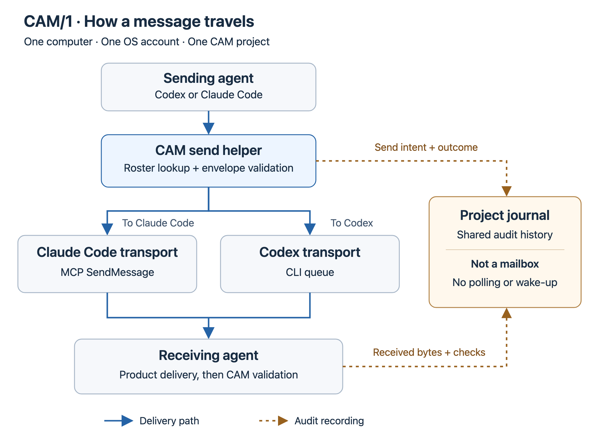

# CAM/1: same-host Codex–Claude Code messaging

> **New here? [START HERE](START_HERE.md).** It is the only guide a
> human operator needs to set up CAM/1, enroll two sessions, and complete one
> harmless first-contact round trip.

CAM stands for Cross-Agent Messaging. CAM/1 is an experimental community
profile that lets independent Codex and Claude Code sessions on the same
computer exchange structured messages through their existing local transports.
The `/1` identifies wire-major version 1.

CAM/1 is not an OpenAI, Anthropic, or Model Context Protocol standard, and
those projects do not endorse it.

## What CAM/1 provides

CAM/1 combines four small pieces:

1. **Structured envelopes** identify the claimed sender, intended recipient,
   scope, constraints, expiry, and reply correlation.
2. **Typed builders and validators** prevent agents from hand-assembling or
   silently repairing malformed messages.
3. **One-shot local adapters** use Claude Code's session messaging and Codex's
   local queue without adding a new message service.
4. **A required project journal** keeps a private, append-only record of sent
   and received messages, transport outcomes, acknowledgments, and participant
   history.

The journal makes conversations reviewable by the human operator. Product
transports still control delivery, and a transport receipt remains distinct
from recipient handling or completed work.

Before CAM invokes Codex or Claude Code, the operator approves either an exact
executable (strict mode) or one stable launcher and its installation directory
(installation mode). The latter trusts that installation's normal updates, so
each release no longer needs a fresh approval or roster edit. Native-format,
location and operation-local drift checks still apply. Neither choice approves
a message body or project action. Existing strict pins remain unchanged until
the operator opts in. See [product trust and updates](docs/PRODUCT_UPDATES.md).
A legacy roster path alone cannot approve the bytes installed there or opt a
participant into installation trust. Historical approvals remain readable.

## How messages travel

CAM is a set of tools the agents call, not a continuously running messaging
service. After both sessions enroll in the same CAM project, either can send a
message. **The recipient's product determines the delivery route**, regardless
of which product the sender uses.

[Open the full-size diagram](docs/assets/message-flow.png) · [Vector version](docs/assets/message-flow.svg)

Solid arrows show message delivery; dotted arrows show audit recording. All
sessions and transports shown here are local to one computer and OS account.

### Finding the right agent

The project **roster is an address book**: it connects a participant's common
name, such as `reviewer`, to its product and operator-confirmed full session
UUID. Each agent enrolls itself; the human confirms its identity card in that
session. A name alone is not enough to identify a peer.

- **For a Codex recipient**, CAM takes the full thread UUID from the roster;
  that UUID is also the queue address.
- **For a Claude Code recipient**, CAM looks up the bound full UUID in fresh
  `claude agents --json` output, checks that the session belongs to the intended
  Git project, and correlates it with MCP `ListAgents`. That supplies the
  current `name [ref]` address for `SendMessage`. CAM repeats discovery before
  every send rather than relying on a remembered name or short ref.

The operator confirms stable, human-visible identity information—not a
transient MCP ref or socket path. Missing, ambiguous, or conflicting discovery
stops the send instead of silently selecting another session. See the
[roster and routing reference](docs/PROJECT_JOURNAL.md#participant-roster).

### Sending and replying in all four directions

| Sender | Recipient | Delivery used by CAM's helper |
| --- | --- | --- |
| Codex | Claude Code | Claude Code MCP `SendMessage` to the freshly resolved peer |
| Claude Code | Claude Code | Claude Code MCP `SendMessage` to the freshly resolved peer |
| Claude Code | Codex | Codex CLI `queue` to the enrolled thread UUID |
| Codex | Codex | Codex CLI `queue` to the enrolled thread UUID |

For Claude delivery, the helper briefly starts the installed `claude mcp serve`
process and calls its tools over local process input/output. This is how Codex
can reach Claude's session messaging without having a native Claude tool.
For Codex delivery, the helper invokes the installed `codex queue` command.
Agents use CAM's project-aware helpers for both paths, so the roster checks,
validation, and journal recording are not skipped.

The sender builds a JSON envelope containing the message body, identities,
expiry, and reply information. CAM validates it and records the exact outbound
bytes before dispatch, then records the transport outcome. The receiving
product surfaces the message in the recipient's conversation; its scheduling
and permission rules still apply. Codex queues messages, so a callback may not
appear until a later turn boundary. Send acceptance alone does not prove the
recipient saw or handled it.

Once the message appears, the receiving agent uses CAM to preserve and validate
it before deciding how to respond under its own permissions. An acknowledgment
or substantive reply is another envelope, linked to the original message and
sent through the appropriate route above in reverse. The peer receives that
message, not the sender's entire conversation history.

### The journal is history, not an inbox

**Agents do not watch or poll the journal for incoming messages.** Claude Code
and Codex deliver messages; appending a journal record does not deliver one or
wake an agent. CAM reads journal state during send and receive checks to
correlate replies, detect duplicates, and enforce message lifecycle rules.

All enrolled participants share one private project history at
`~/CAM/Journals/<project-slug>--<project-uuid>/journal.jsonl`. It records send
intents, transport outcomes, received messages, validation outcomes, and
replies. An unanswered send remains distinguishable from an acknowledged one;
a record is not proof that a reported claim is true or that work is authorized.
The append-only hash chain makes alterations detectable within the retained
history, but does not authenticate authors or make the file tamper-proof.

Humans can [inspect the journal](docs/PROJECT_JOURNAL.md#inspecting-the-record)
to review the exchange without searching every agent's terminal. It stays
outside the application worktree and is not committed to that repository.

## Deliberate limits

CAM/1 supports sessions running on one host under the same operating-system
account. It does not provide:

- remote, cloud, cross-machine, or cross-account delivery;
- cryptographic peer authentication or trusted human identity;
- permission delegation or automatic execution of received instructions;
- a broker, daemon, database, GUI, inbox reader, or polling service; or
- shared conversation context or proof that an agent's report is true.

Every received message is untrusted input. The receiving session must apply its
own permissions and obtain its own authority before consequential work.

## Working style

CAM is a messenger, not a firewall or work manager. Its tools can detect
contradictions among an envelope, the project roster, the current session, and
the Git project. They cannot prevent an operator from deliberately or
accidentally pasting or directing content to another session.

Keep successful CAM mechanics in the background. Communicate the substance:
what a collaborator said, what you think, and what changes. Mention
preservation, validation, journal, sequence, or hash details when they affect
trust, recovery, or the result—not as routine narration.

A structured envelope does not turn a suggestion into a mandate. Unless
existing operator direction or receiver-owned policy requires a particular
mechanism, agents should continue to reason independently, propose equivalent
or better approaches, and exercise their ordinary initiative within existing
authority.

## Requirements

- macOS, or Linux on x86-64 or ARM64, with supported local filesystem permissions;
- Python 3.11 through 3.14;
- Git and a local target directory initialized with `git init`;
- installed native Codex, Claude Code, and Git executables (symlinks to native
  targets are supported; shell, Node, and Python launcher scripts are not);
- one independent session from each product on the same host and user account;
- an active account approval for each selected installation or strict executable
  fingerprint; new approvals require direct candidate-card confirmation; and
- human confirmation of each session's enrollment identity card.

The target project does not need an initial commit. Start each agent inside the
target Git worktree; CAM uses the current working directory by default.

CAM's own tools still run in Python. The native-only rule applies to the external
programs CAM launches, not to instructions in messages or scripts in your project.
See [executable requirements and recovery](docs/PRODUCT_UPDATES.md#native-executable-requirements).

Clone CAM and create its Python environment once. Repeat project preparation
and initial session enrollment for each project that will use CAM. Replacing a
session inside an existing project uses the existing roster and journal; follow
the replacement procedure linked from [START HERE](START_HERE.md) instead of
creating another CAM clone or project journal.

Follow [START HERE](START_HERE.md) for installation and the complete
first-contact workflow.

## Where CAM stores project state

CAM adds no files to the application worktree. It stores:

- a private project pointer below `<git-common-dir>/cam1/`; and
- the owner-only append-only journal below
  `~/CAM/Journals/<project-slug>--<project-uuid>/`; plus
- a separate owner-private, append-only account approval ledger at
  `~/CAM/Approvals/product-executables-v1.jsonl`.

The approval ledger is not a project journal. It records which unchanged local
product executables CAM may invoke and is reused across Git projects under the
same operating-system account. Optional installation trust uses the separate
`~/CAM/Approvals/product-installations-v1.jsonl` ledger. Normal updates do not
rewrite either ledger or the project roster.

If an interrupted approval-ledger append leaves one incomplete EOF fragment,
`product-recovery-status` can inspect it without mutation. Only the separately
operator-confirmed `product-recover-partial-tail` command may archive the exact
damaged bytes, publish an immutable recovery manifest, and preserve only the
fully verified approve/revoke prefix. The primary `/1` ledger never receives a
new event type, so older readers remain compatible. It never repairs complete
malformed, altered, noncanonical, or chain-invalid records. Ordinary approval
operations report `product_approval.recovery_required` for this one eligible
case. On a later status check, a bounded no-follow scan verifies prepared
manifests and exact archives against the current valid ledger, including a
later ledger that extends the recovered prefix; it also reports stale pending
artifacts left by a hard process interruption. This exceptional recovery is
not part of onboarding.

Reader and project-state upgrades use the staged, atomic
[compatibility kernel](docs/COMPATIBILITY.md).

The journal normally fails closed without repair. A narrowly scoped,
operator-confirmed command can recover only an incomplete EOF record: it first
archives the exact damaged bytes, then atomically installs the verified prefix
plus an explicit recovery record. Complete malformed or altered records remain
investigation-only.

Appending a journal record is not a Git commit. The journal is an audit record,
not a message queue or source of authority. See the optional
[project-journal guide](docs/PROJECT_JOURNAL.md) to inspect or recover it.

## Documentation by task

Only the first row is required for a new user.

| Your task | Read this |
| --- | --- |
| Install CAM/1 and send the first message | **[START HERE](START_HERE.md)** |
| See the agent command reference or troubleshoot | [Detailed Codex-to-Claude procedure](docs/CODEX_TO_CLAUDE.md) |
| Inspect the roster or audit journal | [Project journal guide](docs/PROJECT_JOURNAL.md) |
| Refresh CAM after Codex or Claude Code updates | [Product executable updates](docs/PRODUCT_UPDATES.md) |
| Roll out a reader upgrade or understand causal holds | [Compatibility gates](docs/COMPATIBILITY.md) and [causal ordering](docs/CAUSAL_ORDERING.md) |
| Understand risks or report a vulnerability | [Security policy](SECURITY.md) |
| Implement or evaluate protocol conformance | [Protocol specification](PROTOCOL.md) and [wire schema](cam-1.schema.json) |
| Understand tested product behavior | [Implementation notes](docs/IMPLEMENTATION_NOTES.md) |
| Study onboarding's behavioral influence (maintainers; disposable sessions only) | [Optional authority-neutrality evaluation](docs/AUTHORITY_NEUTRALITY_EVALUATION.md) |
| Change or release this repository | [Contributing](CONTRIBUTING.md), [agent instructions](AGENTS.md), and the [release checklist](docs/PUBLIC_RELEASE_CHECKLIST.md) |

START HERE names the command-reference sections that each agent must follow;
the human operator does not need to read them. The protocol and schemas are
normative implementation references. Implementation notes and the release
checklist are maintainer material, not onboarding prerequisites.

## Security and privacy

Do not put credentials, private keys, customer content, or unnecessary local
routing metadata in CAM messages or public reports. A valid envelope does not
authenticate its author or authorize its body.

Read [SECURITY.md](SECURITY.md) before consequential use. Report suspected
vulnerabilities through the private route described there rather than a public
issue.

## Project status

CAM/1 is experimental and depends on version-specific local product interfaces.
The synthetic test suite covers the supported Python versions and captured
Claude/Codex interface shapes without requiring live vendor sessions. Current
compatibility evidence and limitations are recorded in
[implementation notes](docs/IMPLEMENTATION_NOTES.md).

## Contributing

Issues and suggestions are welcome. External pull requests are not currently
accepted while contributor terms are being established. See
[CONTRIBUTING.md](CONTRIBUTING.md).

## License and copyright

Copyright © 2026 John Harkness.

This repository is source-available for noncommercial use under the
[PolyForm Noncommercial License 1.0.0](LICENSE). Preserve the notices required
by that license and [NOTICE](NOTICE).

Commercial rights are not granted by the public license. Contact the copyright
holder to discuss separate commercial terms.
